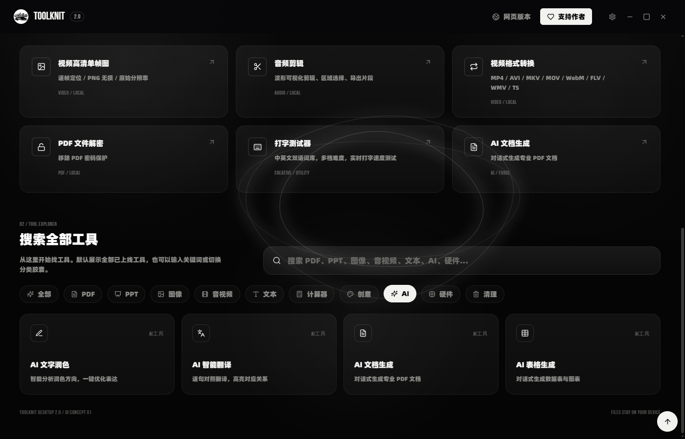
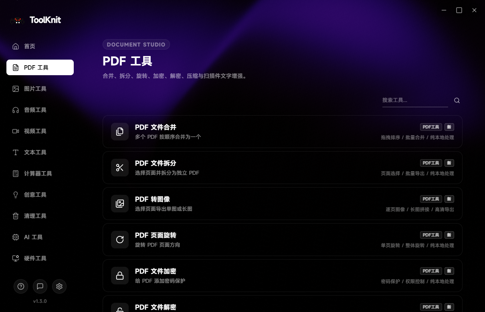
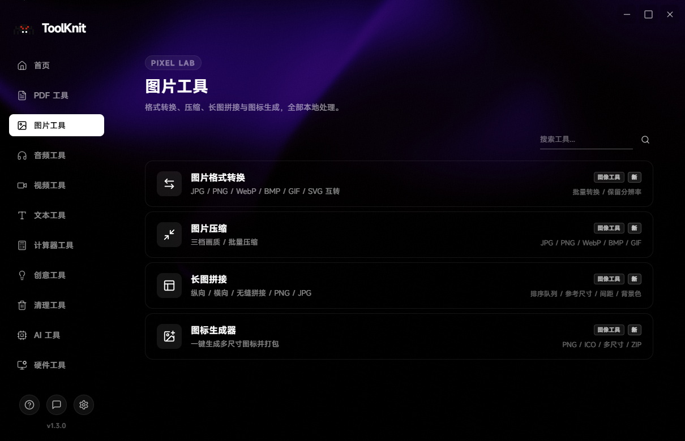
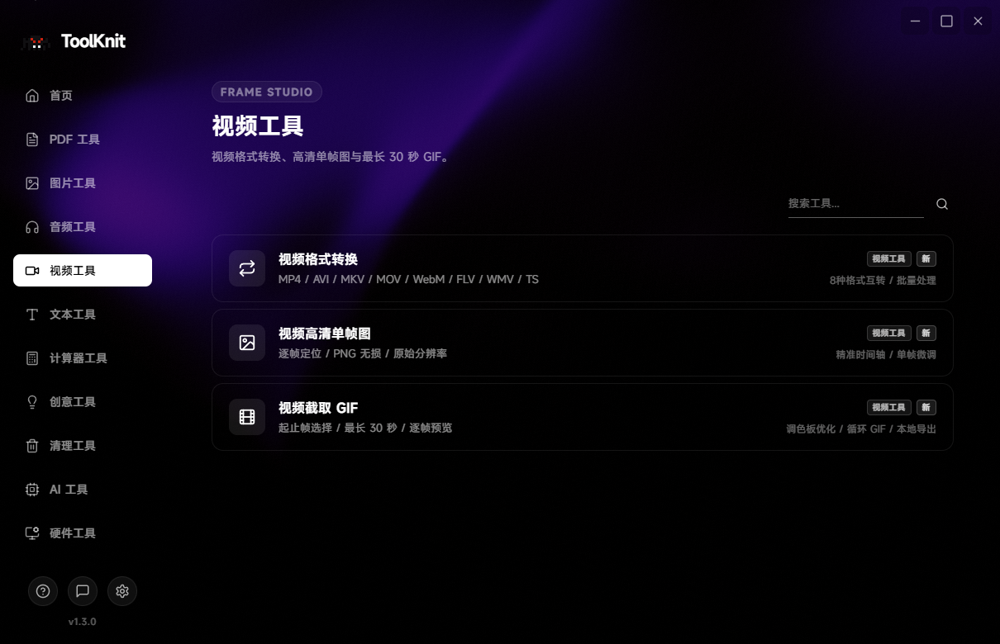
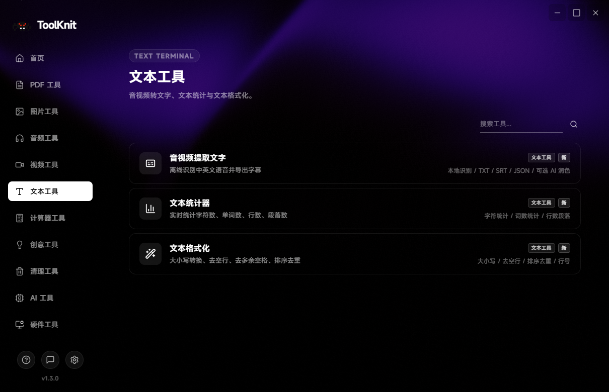
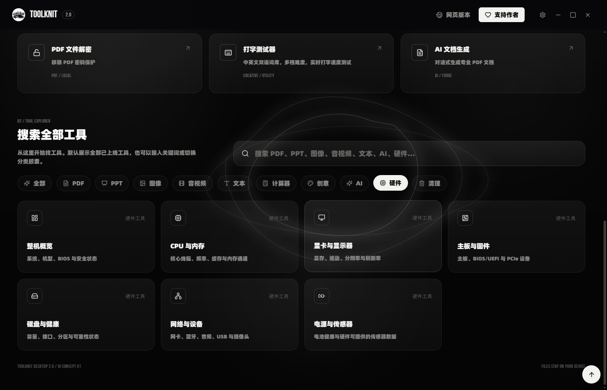

<div align="center">


<h1>ToolKnit Desktop 2.0</h1>

<p><strong>本地文件工作台 · 桌面端、网页端与 AI Agent 工作流</strong></p>

<p>
  把 PDF、PPT、图像、音频、视频、文本和 AI 内容工作，收拢到一套清晰、可靠、可复用的工具体系里。
</p>

<p>
  <a href="https://toolknit.com"></a>
  <a href="https://github.com/ZihangDong/toolknit-desktop/releases"></a>
  <a href="#cli--mcp--agent"></a>
</p>

<p>
  
  
  
  
  <a href="LICENSE"></a>
</p>

<p>
  <a href="https://github.com/ZihangDong/toolknit-desktop/stargazers"></a>
  <a href="https://github.com/ZihangDong/toolknit-desktop/network/members"></a>
  <a href="https://github.com/ZihangDong/toolknit-desktop/issues"></a>
  <a href="https://github.com/ZihangDong/toolknit-desktop/graphs/contributors"></a>
</p>

</div>

<table>
  <tr>
    <td width="50%" valign="top">
      <h2>先用网页版</h2>
      <p>无需安装，打开浏览器即可使用同名官方网页端。</p>
      <p><a href="https://toolknit.com"><strong>打开 ToolKnit.com →</strong></a></p>
      <p><sub>适合快速体验、跨平台使用和不方便安装桌面应用的场景。</sub></p>
    </td>
    <td width="50%" valign="top">
      <h2>再用桌面端</h2>
      <p>Windows 本地优先版本，适合长期文件工作、离线处理和可视化编辑。</p>
      <p><a href="https://github.com/ZihangDong/toolknit-desktop/releases"><strong>查看桌面端下载 →</strong></a></p>
      <p><sub>2.0 正式安装包发布后，会同步更新 Release 入口。</sub></p>
    </td>
  </tr>
</table>

## ToolKnit 2.0

ToolKnit Desktop 2.0 是一套面向 Windows 的本地文件工作台。它把常用文件处理、AI 内容生产、专业文档工作流和 IDE Agent 自动化放在同一个产品体系里。

2.0 的核心方向不是堆叠孤立工具，而是让同一份本地文件可以被桌面端预览、被 CLI 批处理、被 MCP Agent 调用，并且拥有明确的输入、输出、进度、错误和安全边界。

<table>
  <tr>
    <td align="center" width="16%"><strong>49</strong><br /><sub>桌面工具</sub></td>
    <td align="center" width="16%"><strong>11</strong><br /><sub>功能分类</sub></td>
    <td align="center" width="16%"><strong>46</strong><br /><sub>MCP 能力</sub></td>
    <td align="center" width="16%"><strong>3</strong><br /><sub>工作方式</sub></td>
    <td align="center" width="18%"><strong>Windows</strong><br /><sub>首发平台</sub></td>
    <td align="center" width="18%"><strong>Local-first</strong><br /><sub>隐私策略</sub></td>
  </tr>
</table>

## 三种工作方式

<table>
  <tr>
    <td width="33%" valign="top">
      
      <h3>网页端</h3>
      <p>开箱即用，无需安装。适合快速处理和跨平台访问。</p>
      <a href="https://toolknit.com">进入 ToolKnit.com</a>
    </td>
    <td width="33%" valign="top">
      
      <h3>桌面端</h3>
      <p>文件留在本机，提供预览、拖拽、批量处理、可视化编辑和依赖管理。</p>
      <a href="https://github.com/ZihangDong/toolknit-desktop/releases">查看 Releases</a>
    </td>
    <td width="33%" valign="top">
      
      <h3>CLI 与 Agent</h3>
      <p>适合脚本、批处理、CI 和 IDE Agent，用自然语言调用可验证的本地能力。</p>
      <a href="#cli--mcp--agent">查看接入方式</a>
    </td>
  </tr>
</table>

## 功能体系

<table>
  <tr>
    <td width="50%" valign="top">
      
      <h3>PDF 工作区</h3>
      <p>PDF 编辑、合并、拆分、逐页转图像、旋转、加密、解密、压缩和扫描件增强。</p>
    </td>
    <td width="50%" valign="top">
      
      <h3>PPT 工作区</h3>
      <p>PPTX 转 PDF、转图片、提取图片素材、提取文本、压缩，以及 AI 大纲和可编辑 PPTX 草稿。</p>
    </td>
  </tr>
  <tr>
    <td width="50%" valign="top">
      
      <h3>图像工具</h3>
      <p>批量格式转换、图片压缩、长图拼接、图标生成和配色提取。</p>
    </td>
    <td width="50%" valign="top">
      
      <h3>音频与视频</h3>
      <p>格式转换、BPM 检测、音频剪辑、提取音轨、视频单帧、GIF 和音视频转文字。</p>
    </td>
  </tr>
  <tr>
    <td width="50%" valign="top">
      
      <h3>AI 工作台</h3>
      <p>AI 润色、AI 翻译、AI 文档和 AI 表格。文档与表格支持检查、编号编辑、撤销和重新渲染。</p>
    </td>
    <td width="50%" valign="top">
      
      <h3>系统工具</h3>
      <p>只读查看整机硬件、CPU、内存、显卡、主板、磁盘、网络和电源；扫描大文件并在确认后清理。</p>
    </td>
  </tr>
  <tr>
    <td width="50%" valign="top">
      
      <h3>文本与转写</h3>
      <p>离线音视频转写、文本统计和格式化。Whisper 模型按需下载，识别结果可选择 AI 二次润色。</p>
    </td>
    <td width="50%" valign="top">
      
      <h3>常用小工具</h3>
      <p>BMI、时间戳、房贷、利息、密码生成和打字测试，适合直接在桌面端快速完成。</p>
    </td>
  </tr>
</table>

## 本地优先与隐私边界

<table>
  <tr>
    <th width="33%">默认本地</th>
    <th width="33%">明确授权</th>
    <th width="33%">按需依赖</th>
  </tr>
  <tr>
    <td valign="top">桌面端的 PDF、图像、音频、视频、文本和非 AI PPT 工具在设备本地处理，源文件不会上传到 ToolKnit 服务器。</td>
    <td valign="top">只有主动使用 AI 润色、翻译、AI 文档、AI 表格或 AI PPT 能力时，相关文字才会发送到你配置的模型服务。</td>
    <td valign="top">FFmpeg、Whisper 模型和 PPT 渲染运行时按需下载，支持依赖检测、校验和镜像源选择。</td>
  </tr>
</table>

CLI 和 MCP 默认要求明确输入与输出路径，不覆盖已有文件；密码等敏感输入不会写入日志、输出 JSON、文件名或 Agent 回复。

## 产品预览

<p align="center">
  
</p>

<p align="center"><sub>2.0 工作台首页预览 · 最终发布截图会随正式版本同步更新</sub></p>

<table>
  <tr>
    <td width="50%" valign="top">
      <p align="center"><strong>ToolKnit.com 网页端</strong></p>
      <a href="https://toolknit.com"></a>
    </td>
    <td width="50%" valign="top">
      <p align="center"><strong>AI 文档工程工作流</strong></p>
      
    </td>
  </tr>
</table>

<details>
  <summary><strong>查看工具分类截图</strong></summary>

<table>
  <tr>
    <td width="50%"><strong>PDF</strong><br /></td>
    <td width="50%"><strong>AI 与内容工作流</strong><br /></td>
  </tr>
  <tr>
    <td width="50%"><strong>图像</strong><br /></td>
    <td width="50%"><strong>音频与视频</strong><br /></td>
  </tr>
  <tr>
    <td width="50%"><strong>文本</strong><br /></td>
    <td width="50%"><strong>硬件</strong><br /></td>
  </tr>
</table>
</details>

## 下载与运行

### 直接使用网页端

打开 [ToolKnit.com](https://toolknit.com)，无需安装即可开始使用网页端工具。

### 安装 Windows 桌面端

从 [GitHub Releases](https://github.com/ZihangDong/toolknit-desktop/releases) 获取安装包。2.0 正式发布后，安装包、校验文件和版本说明会在 Release 页面同步提供。

当前版本仍处于 2.0 发布准备阶段，正式安装包发布前请以仓库 Release 页面为准。

### 从源码运行

```powershell
git clone https://github.com/ZihangDong/toolknit-desktop.git
Set-Location toolknit-desktop\toolknit-desktop
npm ci
npm run tauri dev
```

要求：Windows 10/11、Node.js `20.12.0` 或更高版本；构建原生桌面端还需要 Rust stable 工具链。

## CLI / MCP / Agent

<a id="cli--mcp--agent"></a>

ToolKnit 将适合自动化的本地文件能力提供给命令行、脚本和支持 MCP 的 IDE Agent。桌面端负责可视化预览和交互，CLI 负责批处理，Agent 负责自然语言编排。

### 安装 CLI

```powershell
npm install --global @toolknit/cli
toolknit doctor --json
toolknit --help
```

### MCP 配置

在 Trae、Cursor、VS Code 或其他支持 MCP 的客户端中添加：

```json
{
  "mcpServers": {
    "toolknit": {
      "command": "toolknit",
      "args": ["mcp", "serve"]
    }
  }
}
```

本地文件工具和非 AI PPT 工具不需要 AI Key。AI 文档、AI 表格、PPT 文本整理、AI PPT 大纲、AI PPTX 草稿和转写后的 `refine` 二次润色，需要在 CLI/MCP 进程环境中配置 `DEEPSEEK_API_KEY` 或 `TOOLKNIT_AI_API_KEY`。

完整说明：

- [CLI 与 MCP 契约](toolknit-desktop/docs/cli-agent.md)
- [中文 Agent 手册](toolknit-desktop/docs/agent-guide.zh-CN.md)
- [English Agent guide](toolknit-desktop/docs/agent-guide.en.md)
- [AI 文档工程规范](toolknit-desktop/docs/ai-document-project-spec.md)

## 贡献者

ToolKnit 的代码、文档、测试、设计和问题反馈都来自真实的协作。贡献者区域会展示参与项目建设的用户头像、姓名和 GitHub 链接。

<p align="center">
  <a href="https://github.com/ZihangDong/toolknit-desktop/graphs/contributors">
    
  </a>
</p>

<p align="center"><sub>上方头像墙会随 GitHub 贡献记录更新；正式发布前将补充手工整理的姓名、角色与个人链接。</sub></p>

<!--
贡献者手工名单模板：
<table>
  <tr>
    <td align="center"><a href="https://github.com/USERNAME"><br /><sub><strong>姓名</strong></sub></a><br /><sub>代码 / 文档 / 设计</sub></td>
  </tr>
</table>
-->

## 捐赠支持者

目前公开记录的项目支持全部来自现金捐赠。每一笔支持都会用于测试设备、依赖镜像、文档维护、版本发布和后续功能开发。

<table>
  <tr>
    <td width="50%" align="center" valign="top">
      <strong>支付宝</strong><br />
      
    </td>
    <td width="50%" align="center" valign="top">
      <strong>微信支付</strong><br />
      
    </td>
  </tr>
</table>

<p align="center"><strong>公开捐赠总额：83.88 元</strong></p>

| 支持者 | 金额 | 日期 |
| --- | ---: | --- |
| 匿名开源支持者 | 23.88 元 | 2026-08-03 |
| 匿名开源支持者 | 2 元 | 2026-08-04 |
| 匿名开源支持者（烤肠基金） | 5 元 | 2026-08-06 |
| 匿名开源支持者 | 50 元 | 2026-08-06 |
| 匿名开源支持者（工具编织） | 3 元 | 2026-08-06 |

<p><sub>捐赠不是付费外包承诺，但会帮助 ToolKnit 保持开源、纯净、可维护和持续更新。公开记录见 <a href="toolknit-desktop/public/contributors.json">contributors.json</a>。</sub></p>

## Star History

<p align="center">
  <a href="https://star-history.com/#ZihangDong/toolknit-desktop&Date">
    
  </a>
</p>

<p align="center"></p>

## 参与项目

- 提交可复现的 [Bug 反馈](https://github.com/ZihangDong/toolknit-desktop/issues/new?template=bug_report.yml)。
- 提交 [功能建议](https://github.com/ZihangDong/toolknit-desktop/issues/new?template=feature_request.yml)。
- 阅读 [贡献指南](CONTRIBUTING.md) 了解开发、测试和 Pull Request 流程。
- 查看 [构建指南](BUILD.md) 在本地运行桌面端。

## 网页端与品牌边界

[ToolKnit.com](https://toolknit.com) 是同名网页端产品，提供无需安装的在线体验和持续更新的网页能力。桌面端开源仓库专注于 Windows 本地文件处理、CLI 和 MCP；网页端的服务、域名、账号、托管服务和运营能力不属于本仓库的开源授权范围。

## 开源协议

ToolKnit Desktop 和 CLI/MCP 源代码采用 [Apache License 2.0](LICENSE) 开源。

该协议不授予 ToolKnit 名称、Logo、视觉标识、域名、官网、托管网页服务、服务账号或其他独立运营产品的使用权。详见 [NOTICE](NOTICE)。

<p align="center">
  <sub>ToolKnit Desktop 2.0 · Local-first tools for real work</sub>
</p>
