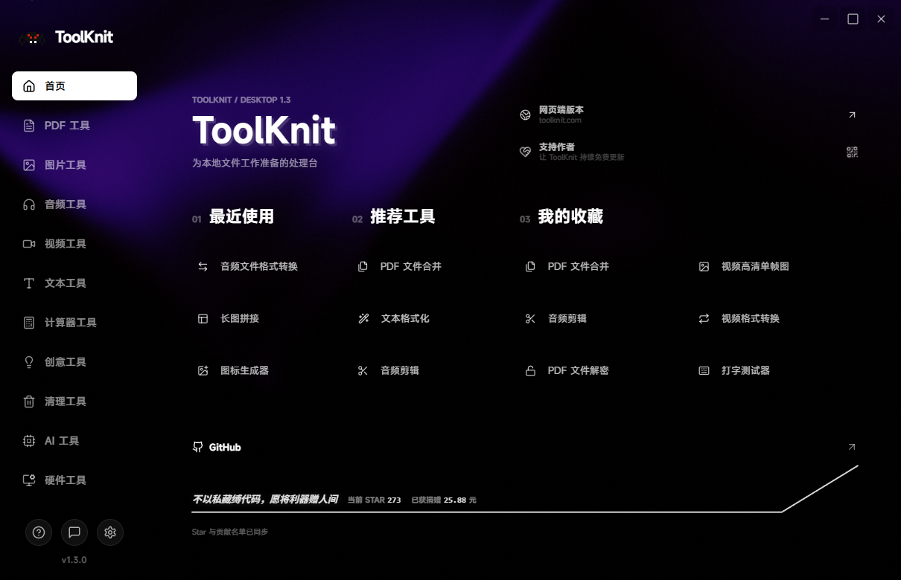
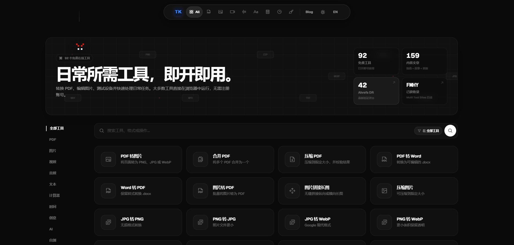
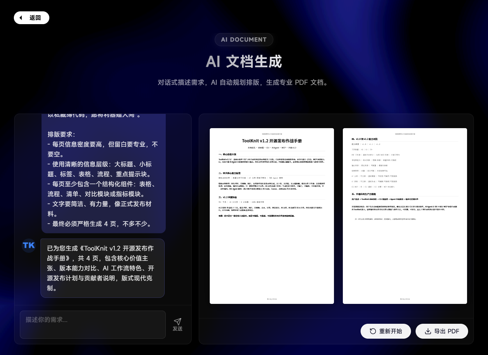
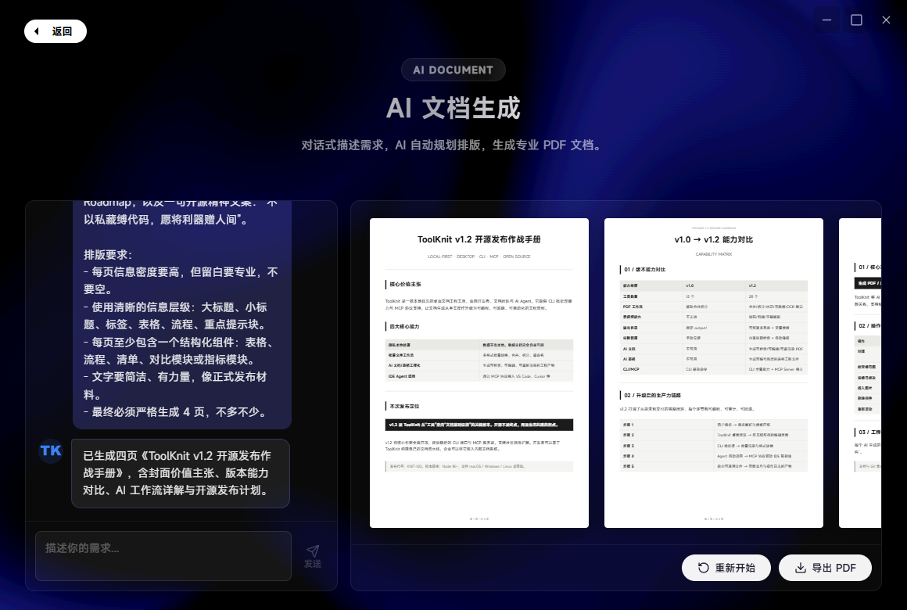

<table>
  <tr>
    <td width="72%" valign="top">
      
    </td>
    <td width="28%" valign="middle" align="center">
      <a href="https://github.com/ZihangDong/toolknit-desktop/stargazers">
        
      </a>
      <br /><br />
      
      <br />
      <strong>不以私藏缚代码，愿将利器赠人间。</strong>
      <br />
      <sub>Star 数由 GitHub 实时徽章展示 · 已获捐赠 83.88 元 · 最近一笔：匿名开源支持者（工具编织）3 元</sub>
    </td>
  </tr>
</table>

<h1 align="center">ToolKnit Desktop</h1>

<p align="center"><em>人生何处不青山</em></p>

<p align="center">
  <strong>多功能本地工具箱 · 桌面端开源版 v1.3</strong><br />
  一个 Windows 应用，整合 PDF、图片、音视频、文本、AI 文档、AI 表格与 CLI / IDE Agent 工作流。默认本地处理，文件不上传。
</p>

<table>
  <tr>
    <td align="center" width="20%"><a href="README_EN.md"><strong>English README</strong><br /><sub>英文说明</sub></a></td>
    <td align="center" width="20%"><a href="https://github.com/ZihangDong/toolknit-desktop/releases"><strong>下载桌面端</strong><br /><sub>Windows 安装包</sub></a></td>
    <td align="center" width="20%"><a href="https://toolknit.com"><strong>访问网页端</strong><br /><sub>toolknit.com</sub></a></td>
    <td align="center" width="20%"><a href="#cli--ide-agent--mcp"><strong>CLI / Agent</strong><br /><sub>MCP 调用</sub></a></td>
    <td align="center" width="20%"><a href="toolknit-desktop/docs/agent-guide.zh-CN.md"><strong>中文 Agent 手册</strong><br /><sub>使用示例</sub></a></td>
  </tr>
</table>

<p align="center">
  <a href="LICENSE"></a>
  
  
  
</p>

<p align="center">
  
</p>

## 项目说明

ToolKnit Desktop 是 ToolKnit 网页端的开源桌面配套版本。它面向希望把文件留在本机、又不想在多个在线工具网站之间来回切换的人：合并 PDF、截取视频单帧、制作 GIF、批量转换媒体、拼接长图、离线提取字幕、生成可编辑 AI 文档和表格，都可以在同一套本地工作流里完成。

适合这些场景：

- 隐私敏感用户：不想把 PDF、图片、音视频上传到陌生网站。
- 办公和学习用户：希望一个桌面工具箱完成高频文件处理。
- 创作者：需要快速从视频、音频、图片中提取素材或生成交付文件。
- 开发者和 AI IDE 用户：希望用 CLI、脚本或 Agent 批量调用本地文件处理能力。

只有在你明确使用 AI 润色、AI 翻译、AI 文档、AI 表格或转写后的 AI 二次校对时，相关文字才会发送到你自行配置的模型服务。普通 PDF、图片、音视频和文本工具默认在本机处理。

## 支持作者

如果 ToolKnit 帮到了你，欢迎把一点点支持留给它。独立开发不容易，但我希望桌面端能继续保持开源、纯净、可离线、可被 Agent 调用。你的支持会被放回测试设备、运行依赖镜像、文档维护、版本发布和后续功能开发里。

<p align="center">
  <strong>当前公开捐赠总额：83.88 元</strong><br />
  <sub>最近一笔：匿名开源支持者（工具编织）· 3 元</sub><br />
  <sub>公开记录见 <a href="toolknit-desktop/public/contributors.json">contributors.json</a></sub>
</p>

<table>
  <tr>
    <th width="30%">支付宝</th>
    <th width="30%">微信支付</th>
    <th width="40%">支持会带来什么</th>
  </tr>
  <tr>
    <td align="center"></td>
    <td align="center"></td>
    <td valign="top">
      <p>
        
        
        
      </p>
      <ul>
        <li><strong>创作不易，开源更不易。</strong> 每一份支持都会悄悄变成下一次更稳的更新。</li>
        <li>如果你有很想要的新工具、新格式或工作流优化，可以在捐赠留言、Issue 或网页端联系我。</li>
        <li>明确、可复现、可维护的需求会被优先评估和排期，让好想法更快进入版本计划。</li>
      </ul>
      <sub>捐赠不是付费外包承诺，但它会帮助我把更多时间投入到 ToolKnit 的开源开发里。</sub>
    </td>
  </tr>
</table>

<p align="center">
  想免安装使用更完整的在线能力？访问 <a href="https://toolknit.com"><strong>toolknit.com</strong></a>
</p>

<p align="center">
  <a href="https://toolknit.com">
    
  </a>
  <br />
  <a href="https://fmhy.net/misc">
    
  </a>
  
  
</p>

## v1.0 到 v1.3

<table>
  <tr>
    <td width="48%" valign="top">
      <h3>v1.0</h3>
      
      <ul>
        <li>20+ 个基础桌面工具。</li>
        <li>以点选式本地处理为主。</li>
        <li>覆盖 PDF、图片、音视频、文本与基础 AI 能力。</li>
        <li>固定输出路径，预览编辑能力较少。</li>
      </ul>
    </td>
    <td width="4%" align="center" valign="middle"><strong>-></strong></td>
    <td width="48%" valign="top">
      <h3>v1.3</h3>
      
      <ul>
        <li>40+ 个桌面工具，新增 PDF 转图像、视频单帧、视频转 GIF、长图拼接、音视频转文字、硬件信息和 AI 大文件清理。</li>
        <li>统一输出根目录、工具二级目录、自定义背景和默认动态背景回退。</li>
        <li>大部分核心文件工具支持 CLI，并提供 31 项 MCP 能力给 IDE Agent 调用。</li>
        <li>AI 文档和 AI 表格升级为可检查、可编号、可编辑、可撤销、可重新渲染的工程工作流。</li>
      </ul>
    </td>
  </tr>
</table>

### AI 文档生成：1.0 vs 工程化工作流

<table>
  <tr>
    <td width="50%" valign="top">
      <h3>AI 文档 1.0</h3>
      
      <ul>
        <li>更偏向一次性生成 PDF。</li>
        <li>适合快速出稿，但二次调整要重新描述。</li>
        <li>没有稳定控件编号，Agent 很难按“第几个元素”精确修改。</li>
      </ul>
    </td>
    <td width="50%" valign="top">
      <h3>AI 文档 1.2（工程化工作流）</h3>
      
      <ul>
        <li>输出 PDF、预览图、控件编号图和可编辑工程。</li>
        <li>文字、图像、表格等组件都有稳定编号，可让 Agent 精准修改。</li>
        <li>支持 inspect、dry-run、commit、undo、render 的可控闭环。</li>
      </ul>
    </td>
  </tr>
</table>

### v1.3 重点更新

<table>
  <tr>
    <td width="50%" valign="top">
      <strong>📄 PDF 转图像</strong><br />
      <sub>按页导出 PNG / JPG，一页一图，适合拆页、取图和后续拼接。</sub>
    </td>
    <td width="50%" valign="top">
      <strong>🧵 长图拼接</strong><br />
      <sub>支持图片和 PDF 页面导入，提供横向 / 纵向拼接、间距、背景和参考尺寸。</sub>
    </td>
  </tr>
  <tr>
    <td width="50%" valign="top">
      <strong>🎞 视频高清单帧图</strong><br />
      <sub>按精确时间点或真实帧率定位，导出 PNG 无损图或高质量 JPG。</sub>
    </td>
    <td width="50%" valign="top">
      <strong>🎬 视频截取 GIF</strong><br />
      <sub>选择起始与结束帧、帧率和宽度，导出最长 30 秒的调色板优化 GIF。</sub>
    </td>
  </tr>
  <tr>
    <td width="50%" valign="top">
      <strong>🎙 音视频提取字幕文字</strong><br />
      <sub>下载本地识别模型后离线转写音频或视频，输出 TXT、SRT、JSON；可选 AI 二次润色。</sub>
    </td>
    <td width="50%" valign="top">
      <strong>🧩 AI 文档大升级</strong><br />
      <sub>生成多页专业 PDF，同时输出可编辑工程、控件编号图和预览图；支持位置互换、颜色、字号、图层与撤销。</sub>
    </td>
  </tr>
  <tr>
    <td width="50%" valign="top">
      <strong>📊 AI 表格工程化</strong><br />
      <sub>生成 CSV/XLSX/PDF/PNG，按稳定行、列、图表编号检查与修改，再重新渲染。</sub>
    </td>
    <td width="50%" valign="top">
      <strong>🗂 PDF 选页体验</strong><br />
      <sub>合并、拆分、旋转等工作流支持预览、逐页选择、全选和安全的返回逻辑。</sub>
    </td>
  </tr>
  <tr>
    <td width="50%" valign="top">
      <strong>⚙ 输出与依赖管理</strong><br />
      <sub>所有输出按工具分类到自定义目录；FFmpeg 和离线模型按需下载、校验与提示。</sub>
    </td>
    <td width="50%" valign="top">
      <strong>🖇 CLI 与 Agent</strong><br />
      <sub>大部分核心文件处理工具拥有确定的命令、进度、错误和输出契约，可由 MCP Agent 自然语言调用。</sub>
    </td>
  </tr>
</table>

## 功能总览

### PDF 工具

| 工具 | 说明 |
| --- | --- |
| PDF 转图像 | 按页导出 PNG / JPG，适合拆页、取图和后续拼接。 |
| PDF 合并 | 选择多个文件和页码后按顺序生成一个 PDF。 |
| PDF 拆分 | 按页导出，支持单页、全部或指定范围。 |
| PDF 旋转 | 对指定页面进行 90/180/270 度旋转。 |
| PDF 加密 / 解密 | 添加或移除 PDF 密码保护。 |
| PDF 压缩 | 按压缩等级减少文件体积并保留原件。 |
| PDF 增强 | 改善扫描件可读性。 |

### 图片、音频与视频

| 分类 | 工具 |
| --- | --- |
| 图片 | 批量格式转换、图片压缩、长图拼接、图标生成、配色提取。 |
| 音频 | 格式转换、BPM 节拍检测、音频剪辑、从视频提取音轨。 |
| 视频 | 格式转换、高清单帧图、最长 30 秒 GIF。 |
| 文本 | 音视频转文字、文本统计、文本格式化。 |

### AI、创意与小工具

| 分类 | 工具 |
| --- | --- |
| AI | AI 润色、AI 翻译、AI 文档、AI 表格。 |
| 计算器 | BMI、时间戳、房贷、利息、密码生成。 |
| 创意 | 打字测试、图片配色提取。 |

计算器和打字测试器更适合桌面交互，v1.3 不刻意接入 CLI/MCP。

## 分类长截图预留

把每个分类的一张长截图放到 `assets/readme/categories/`，建议按下面命名：

| 分类 | 建议文件名 | 说明 |
| --- | --- | --- |
| PDF 工具 | `assets/readme/categories/category-pdf.png` | PDF 分类长截图。 |
| 图片工具 | `assets/readme/categories/category-image.png` | 图片分类长截图。 |
| 音频工具 | `assets/readme/categories/category-audio.png` | 音频分类长截图。 |
| 视频工具 | `assets/readme/categories/category-video.png` | 视频分类长截图。 |
| 文本工具 | `assets/readme/categories/category-text.png` | 文本分类长截图。 |
| AI 工具 | `assets/readme/categories/category-ai.png` | AI 分类长截图。 |
| 计算器工具 | `assets/readme/categories/category-calculator.png` | 计算器分类长截图。 |
| 创意工具 | `assets/readme/categories/category-creative.png` | 创意分类长截图。 |
| 硬件工具 | `assets/readme/categories/category-hardware.png` | 如果后面单独做硬件分类，可用这个。 |
| 清理工具 | `assets/readme/categories/category-cleanup.png` | 如果后面单独做清理分类，可用这个。 |

更详细的命名说明见 [assets/readme/categories/README.md](assets/readme/categories/README.md)。

## 下载与使用

### 桌面端

从 [GitHub Releases](https://github.com/ZihangDong/toolknit-desktop/releases) 下载 Windows 安装包。首次运行不强制下载附加组件；进入需要 FFmpeg 或离线转写模型的工具时，桌面端会解释原因并提供设置入口。

当前 Windows 安装包暂未购买商业代码签名证书，SmartScreen 可能显示“未知发布者”。请只从本仓库 Releases 下载，并先核对同页提供的 `.sha256` 文件；校验一致后再选择“更多信息 -> 仍要运行”。

在设置中可以：

- 选择全局输出根目录，所有工具自动进入对应二级目录。
- 配置 DeepSeek/OpenAI 兼容 AI Provider。
- 下载 FFmpeg、Whisper 模型，并选择官方源或镜像源。
- 上传图片或视频作为首页和分类页背景，也可以一键恢复默认动态背景。

### 从源码运行

```powershell
git clone https://github.com/ZihangDong/toolknit-desktop.git
Set-Location toolknit-desktop\toolknit-desktop
npm ci
npm run tauri dev
```

要求：Windows 10/11、Node.js `20.12.0` 或更高版本；构建原生桌面端还需要 Rust stable 工具链。

## CLI / IDE Agent / MCP

<a id="cli--ide-agent--mcp"></a>

v1.3 将桌面端核心文件处理能力抽成可验证的 CLI/MCP 契约。桌面端适合预览与可视化编辑；CLI 适合脚本、批处理和 CI；IDE Agent 可以通过 MCP 调用同一套能力，不需要一直打开桌面程序。

### 正式 npm 安装（推荐）

```powershell
npm install --global @toolknit/cli
toolknit doctor --json
toolknit --help
```

如果国内镜像暂未同步新版本，安装时可能出现 `404 Not Found`。这不是包不存在，改用 npm 官方源即可：

```powershell
npm install --global @toolknit/cli --registry=https://registry.npmjs.org
```

CLI 默认不覆盖已有文件；JSON 与 MCP 输出不会混入 ASCII 横幅；PDF 密码等敏感输入会走受保护输入方式，避免进入命令历史。

### 从源码调试（维护者可选）

```powershell
Set-Location toolknit-desktop\toolknit-desktop
npm ci
npm run cli -- doctor
npm run cli -- help
npm run cli -- help pdf split
```

### MCP 配置示例

在 Trae、Cursor、VS Code 或其他支持 MCP 的客户端中添加：

```json
{
  "mcpServers": {
    "toolknit": {
      "command": "toolknit",
      "args": ["mcp", "serve"]
    }
  }
}
```

PDF、图片、音视频和文本等本地工具不需要 AI Key。只有使用 AI 文档、AI 表格或转写后的 `refine` 二次校对时，才需要在 IDE 的 MCP 环境变量/密钥设置中为 `toolknit` 添加真实的 `DEEPSEEK_API_KEY`（也支持 `TOOLKNIT_AI_API_KEY`），然后重启 IDE。不要保留说明文字或把密钥写进 Agent 对话；桌面端保存的密钥不会自动共享给 CLI/MCP。

推荐对 Agent 这样说：

> 先检查本地文件，再用 ToolKnit 处理。输出到当前项目的 `toolknit-output`，不要覆盖已有文件。AI 文档和 AI 表格修改请按 `inspect -> dry-run -> commit -> render` 执行。

完整手册：

- [CLI 与 MCP 契约](toolknit-desktop/docs/cli-agent.md)
- [中文 Agent 手册](toolknit-desktop/docs/agent-guide.zh-CN.md)
- [English Agent guide](toolknit-desktop/docs/agent-guide.en.md)
- [AI 文档工程规范](toolknit-desktop/docs/ai-document-project-spec.md)

## 网页端

ToolKnit 网页端提供免安装、跨平台的在线体验与更多持续更新的能力：[toolknit.com](https://toolknit.com)。网页端已被 [FMHY](https://fmhy.net/misc) 收录在工具导航中，条目为 ToolKnit 的图片、视频、PDF、音频与文件处理能力。

桌面端开源仓库专注于 Windows 本地文件处理、CLI 和 MCP。网页端的服务、域名、账号、视觉品牌和运营能力不属于本仓库的开源授权范围。

## 开发、反馈与文档

| 内容 | 链接 |
| --- | --- |
| 构建指南 | [BUILD.md](BUILD.md) |
| 贡献指南 | [CONTRIBUTING.md](CONTRIBUTING.md) |
| 更新日志 | [toolknit-desktop/CHANGELOG.md](toolknit-desktop/CHANGELOG.md) |
| 提交 Bug / 建议 | [GitHub Issues](https://github.com/ZihangDong/toolknit-desktop/issues) |

## 开源协议与品牌说明

本仓库中的 ToolKnit Desktop 和 CLI/MCP 源代码采用 [Apache License 2.0](LICENSE) 开源。

协议不授予 ToolKnit 名称、Logo、视觉标识、域名、官网、托管网页服务、服务账号或其他独立运营产品的权利。详见 [NOTICE](NOTICE)。
