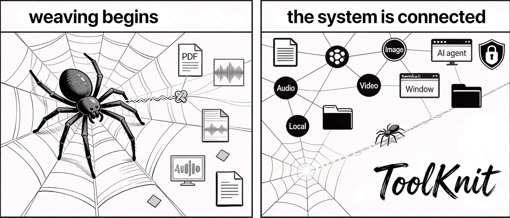
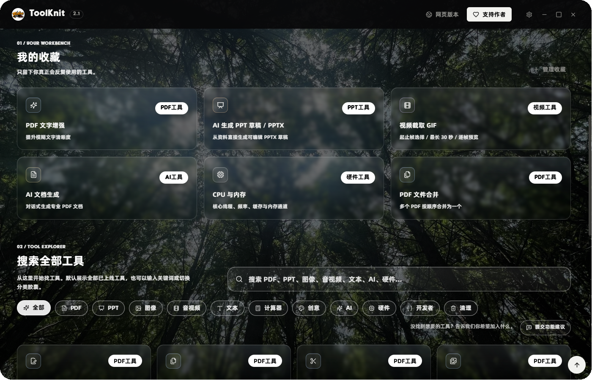
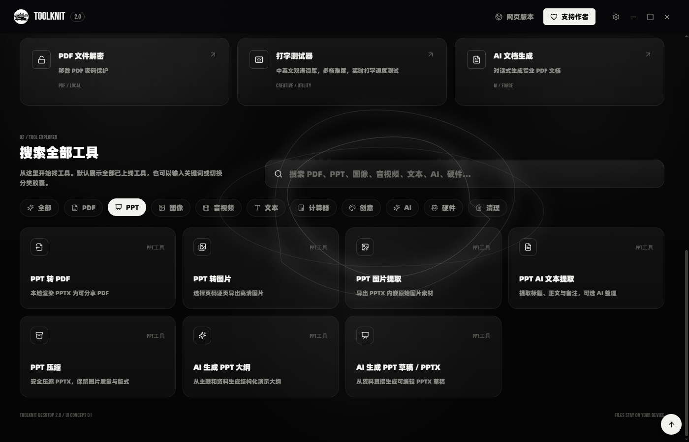
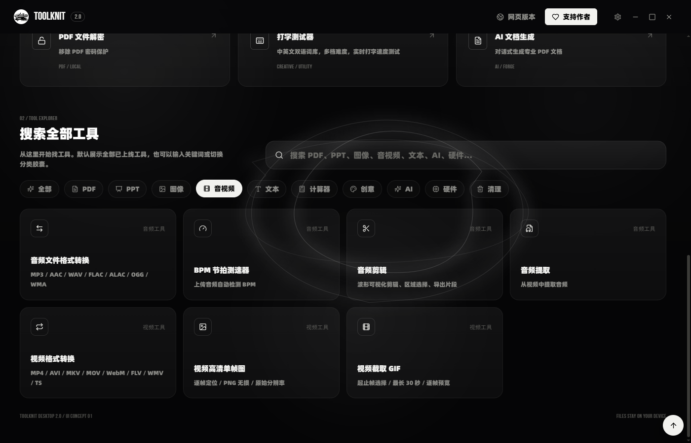
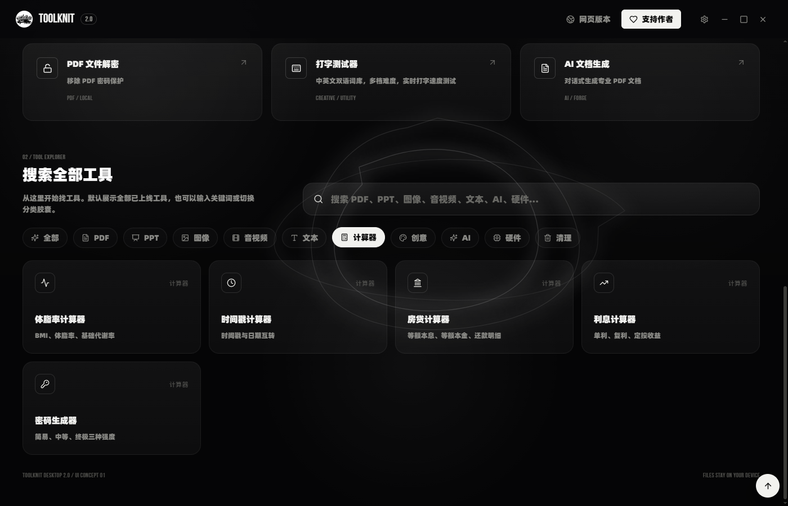
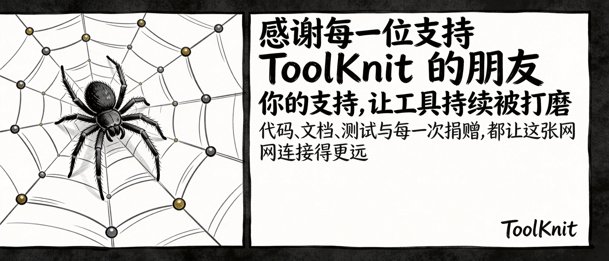

<div align="center">



<h1>ToolKnit Desktop 2.1</h1>

<p><strong>Local file workbench · Desktop, web, and AI Agent workflows</strong></p>

<p>
  Bring PDF, PPT, image, audio/video, Markdown, developer, and AI work into one clear, reliable, reusable tool system.
</p>

<p>
  <a href="https://toolknit.com"></a>
  <a href="https://github.com/ZihangDong/toolknit-desktop/releases"></a>
  <a href="#cli--mcp--agent"></a>
</p>

<p>
  <a href="README.md"></a>
  
  
  
  
  <a href="LICENSE"></a>
</p>

<p>
  <a href="https://github.com/ZihangDong/toolknit-desktop/stargazers"></a>
  <a href="https://github.com/ZihangDong/toolknit-desktop/network/members"></a>
  <a href="https://github.com/ZihangDong/toolknit-desktop/issues"></a>
  <a href="https://github.com/ZihangDong/toolknit-desktop/graphs/contributors"></a>
</p>

</div>

<table cellpadding="18" cellspacing="0">
  <tr>
    <td width="50%" valign="top">
      <p> <strong>Start with the web version</strong></p>
      <p>No installation required. Open the official web version in your browser.</p>
      <p><a href="https://toolknit.com"><strong>Open ToolKnit.com</strong></a></p>
      <sub>Ideal for a quick start, cross-platform access, or situations where a desktop install is not convenient.</sub>
    </td>
    <td width="50%" valign="top">
      <p> <strong>Use the desktop app</strong></p>
      <p>A local-first Windows app for long-running file work, offline processing, and visual editing.</p>
      <p><a href="https://github.com/ZihangDong/toolknit-desktop/releases"><strong>View desktop downloads</strong></a></p>
      <sub>The 2.1.1 installer, checksum, and release notes are published through GitHub Releases.</sub>
    </td>
  </tr>
</table>

## ToolKnit 2.1

ToolKnit Desktop 2.1 is a local file workbench for Windows. It brings everyday file processing, image and Markdown creation, developer tools, AI content production, professional document workflows, and IDE Agent automation into one product system.

The same local file can be previewed in the desktop app, batch-processed by the CLI, or called by an MCP Agent, with explicit input, output, progress, error, and safety boundaries.

<table width="100%" cellpadding="14" cellspacing="0">
  <tr>
    <td align="center"><h3>60</h3><strong>Desktop tools</strong></td>
    <td align="center"><h3>12</h3><strong>Categories</strong></td>
    <td align="center"><h3>46</h3><strong>MCP capabilities</strong></td>
    <td align="center"><h3>3</h3><strong>Ways to work</strong></td>
    <td align="center"><h3>Windows</h3><strong>Launch platform</strong></td>
    <td align="center"><h3>Local-first</h3><strong>Privacy model</strong></td>
  </tr>
</table>

## What's new in the 2.1 series

The 2.1 series adds 11 desktop tools and delivers a broader upgrade across custom backgrounds, glass interactions, local dependency reuse, task lifecycle management, and failure recovery. Heavy editors and algorithm modules load on demand, while Workers, canvases, listeners, and temporary resources are released when a tool closes.

<table cellpadding="16" cellspacing="0">
  <tr>
    <td width="50%" valign="top">
      <p></p>
      <h3>Markdown Document Editor</h3>
      <p>Edit with split-screen GFM, Mermaid, and math previews, plus a heading outline, local drafts, and Markdown or self-contained HTML export.</p>
    </td>
    <td width="50%" valign="top">
      <p></p>
      <h3>Image Crop and Smart Color Replace</h3>
      <p>Crop with ratio presets, composition guides, center snapping, and source-resolution export; replace colors with sampling, thresholds, feathering, and connected-region protection.</p>
    </td>
  </tr>
  <tr>
    <td width="50%" valign="top">
      <p></p>
      <h3>Color Space Compare</h3>
      <p>Inspect eight linked color spaces, test sRGB, Display P3, Adobe RGB, and Rec.2020 gamut membership, and adjust components on visual tracks.</p>
    </td>
    <td width="50%" valign="top">
      <p></p>
      <h3>Developer Tools Category</h3>
      <p>Adds JSON formatting, Base64 and URL codecs, batch UUID v4 generation, and local JWT inspection. Inputs and results remain in the current session.</p>
    </td>
  </tr>
  <tr>
    <td width="50%" valign="top">
      <p></p>
      <h3>Hash &amp; Crypto</h3>
      <p>Covers 17 digest, file hash, HMAC, symmetric, and asymmetric modules. Legacy algorithms are marked for compatibility only, and sensitive data is never persisted to history.</p>
    </td>
    <td width="50%" valign="top">
      <p></p>
      <h3>Custom Background and Glass Workbench</h3>
      <p>Use image or video wallpapers across a unified glass interface, with restrained water-film card feedback and stronger readability on complex backgrounds.</p>
    </td>
  </tr>
  <tr>
    <td width="50%" valign="top">
      <p></p>
      <h3>PDF Editing and Safe Output</h3>
      <p>Adds page duplication, blank pages, batch selection, repeatable text edits, and unsaved-change protection before close, replace, or reset actions.</p>
    </td>
    <td width="50%" valign="top">
      <p></p>
      <h3>Dependency Reuse and Performance</h3>
      <p>Detects existing FFmpeg and LibreOffice installations first, downsamples preview work, discards stale tasks, and releases background resources when pages close.</p>
    </td>
  </tr>
</table>

<p align="center"><sub>The color-space conversion core is a controlled port and extension of <a href="https://github.com/ZihangDong/toolknit-desktop/pull/23">Joshua-Zion's PR #23</a>; the corresponding commit retains co-author attribution.</sub></p>

## Three ways to work

<table cellpadding="16" cellspacing="0">
  <tr>
    <td width="33%" valign="top">
      <p></p>
      <h3>Web</h3>
      <p>Ready immediately, with no installation. Good for quick processing and cross-platform access.</p>
      <a href="https://toolknit.com">Open ToolKnit.com</a>
    </td>
    <td width="33%" valign="top">
      <p></p>
      <h3>Desktop</h3>
      <p>Files stay on your device, with preview, drag-and-drop, batch processing, visual editing, and dependency management.</p>
      <a href="https://github.com/ZihangDong/toolknit-desktop/releases">View Releases</a>
    </td>
    <td width="33%" valign="top">
      <p></p>
      <h3>CLI and Agent</h3>
      <p>For scripts, batch jobs, CI, and IDE Agents that call verifiable local capabilities in natural language.</p>
      <a href="#cli--mcp--agent">See the integration guide</a>
    </td>
  </tr>
</table>

## Complete tool catalog

The 12 desktop categories below contain all 60 tools. Names correspond to in-app entries; CLI and MCP capabilities use the same input/output contracts as each tool becomes ready.

<table width="100%" border="0" cellpadding="0" cellspacing="0">
  <tr><td align="left" style="border:0;"></td><td align="right" style="border:0;"><h3 align="right">PDF tools · 9</h3></td></tr>
</table>

`PDF Merge` · `PDF Split` · `PDF to Image` · `PDF Editor` · `PDF Page Rotate` · `PDF Encrypt` · `PDF Decrypt` · `PDF Compress` · `PDF Enhance`

Supports drag sorting, page-by-page preview, page selection, rotation, text replacement, text and image insertion, append merge, password protection, scanned-document enhancement, and multiple compression levels. PDFs, passwords, and exported results are processed locally by default.

<table width="100%" border="0" cellpadding="0" cellspacing="0">
  <tr><td align="left" style="border:0;"></td><td align="right" style="border:0;"><h3 align="right">PPT tools · 7</h3></td></tr>
</table>

`PPT to PDF` · `PPT to Image` · `PPT Image Extractor` · `PPT Text Extractor` · `PPT Compress` · `AI PPT Outline` · `AI PPT Draft / PPTX`

Supports page rendering, page selection, PNG/JPG/WebP output, duplicate asset filtering, title/body/notes extraction, Markdown/TXT/JSON export, media cleanup, and structured outlines plus editable PPTX drafts generated from a brief and source material. The PPT rendering runtime is downloaded on demand.

<table width="100%" border="0" cellpadding="0" cellspacing="0">
  <tr><td align="left" style="border:0;"></td><td align="right" style="border:0;"><h3 align="right">Image tools · 6</h3></td></tr>
</table>

`Image Crop` · `Smart Color Replace` · `Image Format Converter` · `Image Compressor` · `Long Image Stitcher` · `Icon Generator`

Supports ratio presets and composition guides for cropping, connected-region color replacement, JPG/PNG/WebP/BMP/GIF/SVG conversion, batch compression, horizontal/vertical/seamless stitching of images or PDF pages, and multi-size PNG, ICO, and SVG icon generation with ZIP output.

<table width="100%" border="0" cellpadding="0" cellspacing="0">
  <tr><td align="left" style="border:0;"></td><td align="right" style="border:0;"><h3 align="right">Audio tools · 4</h3></td></tr>
</table>

`Audio Format Converter` · `BPM Detector` · `Audio Cutter` · `Audio Extractor`

Supports MP3, AAC, WAV, FLAC, ALAC, OGG, WMA, and other formats, offline BPM analysis, waveform-based cutting, and audio extraction from video. FFmpeg is installed on demand, and source files are never overwritten.

<table width="100%" border="0" cellpadding="0" cellspacing="0">
  <tr><td align="left" style="border:0;"></td><td align="right" style="border:0;"><h3 align="right">Video tools · 3</h3></td></tr>
</table>

`Video Format Converter` · `HD Video Frame` · `Video to GIF`

Supports MP4, AVI, MKV, MOV, WebM, FLV, WMV, TS, M4V, and other formats, exact-time PNG/JPG frame export, and palette-optimized GIF creation from clips up to 30 seconds.

<table width="100%" border="0" cellpadding="0" cellspacing="0">
  <tr><td align="left" style="border:0;"></td><td align="right" style="border:0;"><h3 align="right">Text and transcription · 4</h3></td></tr>
</table>

`Markdown Document Editor` · `Audio/Video Transcription` · `Text Statistics` · `Text Formatter`

The Markdown editor provides GFM, Mermaid, math, a heading outline, draft recovery, and offline export. After downloading a Whisper model locally, the app can transcribe Chinese and English audio/video offline and export TXT, SRT, and JSON. Text Statistics and Text Formatter help inspect and clean up plain text.

<table width="100%" border="0" cellpadding="0" cellspacing="0">
  <tr><td align="left" style="border:0;"></td><td align="right" style="border:0;"><h3 align="right">Calculator tools · 5</h3></td></tr>
</table>

`Body Fat Calculator` · `Timestamp Calculator` · `Mortgage Calculator` · `Interest Calculator` · `Password Generator`

Covers health estimates, Unix timestamp conversion, mortgage payments, simple/compound interest, and secure random password generation for quick desktop calculations.

<table width="100%" border="0" cellpadding="0" cellspacing="0">
  <tr><td align="left" style="border:0;"></td><td align="right" style="border:0;"><h3 align="right">Creative tools · 3</h3></td></tr>
</table>

`Color Extractor` · `Color Space Compare` · `Typing Test`

Extract dominant image colors and palette shares, compare eight linked color spaces with common gamut checks, or practice Chinese and English typing with timing, speed, accuracy, and result statistics.

<table width="100%" border="0" cellpadding="0" cellspacing="0">
  <tr><td align="left" style="border:0;"></td><td align="right" style="border:0;"><h3 align="right">Cleanup tools · 2</h3></td></tr>
</table>

`AI Large File Cleanup` · `C Drive Cleanup`

Large File Cleanup scans locally, then lets local rules and optional AI analyze only filenames, sizes, modification times, and directory clues. C Drive Cleanup checks reclaimable system space by risk level. Every deletion is confirmed item by item and sent to the Recycle Bin; file contents are not read or uploaded.

<table width="100%" border="0" cellpadding="0" cellspacing="0">
  <tr><td align="left" style="border:0;"></td><td align="right" style="border:0;"><h3 align="right">AI Workbench · 4</h3></td></tr>
</table>

`AI Polish` · `AI Translate` · `AI Document Generation` · `AI Table Generation`

AI Documents support multi-page PDFs, editable project files, numbered maps, preview, inspection, editing, undo, and re-rendering. AI Tables support CSV, XLSX, PDF, PNG, editable projects, numbered rows/columns/charts, formula edits, and re-rendering. Text is sent to your configured model service only when you explicitly invoke AI.

<table width="100%" border="0" cellpadding="0" cellspacing="0">
  <tr><td align="left" style="border:0;"></td><td align="right" style="border:0;"><h3 align="right">Hardware tools · 7</h3></td></tr>
</table>

`System Overview` · `CPU and Memory` · `GPU and Displays` · `Mainboard and Firmware` · `Storage Health` · `Network Devices` · `Power Sensors`

Read-only views cover Windows, device model, CPU, memory, graphics, displays, mainboard, BIOS, Secure Boot, TPM, virtualization, disks, network, and power sensors. The CPU and Memory page also provides live status refresh.

<table width="100%" border="0" cellpadding="0" cellspacing="0">
  <tr><td align="left" style="border:0;"></td><td align="right" style="border:0;"><h3 align="right">Developer tools · 6</h3></td></tr>
</table>

`JSON Formatter` · `Base64 Codec` · `URL Codec` · `UUID Generator` · `JWT Viewer` · `Hash & Crypto`

Validate, format, and minify JSON; process UTF-8 Base64; encode URL parameters; generate UUID v4 batches; inspect JWT Header and Payload; and run digest, file hash, HMAC, symmetric, and asymmetric workflows locally. Sensitive input is not persisted, and current-session data is cleared when the page closes.

## Local-first privacy boundaries

 **Local by default**: Desktop PDF, PPT, image, audio, video, text, calculator, hardware, and cleanup tools run on the device. Source files are not uploaded to ToolKnit servers.

 **Explicit authorization**: Related text is sent to your configured model service only when you actively use AI Polish, AI Translate, AI Documents, AI Tables, PPT text AI organization, AI PPT Outline, AI PPTX Draft, or transcription `refine`.

 **On-demand dependencies**: Existing FFmpeg and LibreOffice installations are reused when possible. Missing runtimes and Whisper models are downloaded as needed, with dependency detection, verification, and mirror selection.

CLI and MCP require explicit input and output paths by default and do not overwrite existing files. Sensitive inputs such as passwords are not written to logs, JSON output, filenames, or Agent replies.

## Technology stack

ToolKnit 2.1 combines a lightweight desktop container with local file engines. The web app, desktop app, CLI, and MCP share clear input/output boundaries.

<table cellpadding="10" cellspacing="0">
  <tr>
    <td width="22%"><strong>Desktop container</strong></td>
    <td>
      
      
      
    </td>
  </tr>
  <tr>
    <td><strong>Interface and build</strong></td>
    <td>
      
      
      
      
    </td>
  </tr>
  <tr>
    <td><strong>Documents and data</strong></td>
    <td>
      
      
      
      
      
    </td>
  </tr>
  <tr>
    <td><strong>Editing and algorithms</strong></td>
    <td>
      
      
      
      
      
    </td>
  </tr>
  <tr>
    <td><strong>Media and runtimes</strong></td>
    <td>
      
      
      
      
    </td>
  </tr>
  <tr>
    <td><strong>Automation interfaces</strong></td>
    <td>
      
      
      
      
    </td>
  </tr>
</table>

## Product previews

<p align="center">
  
</p>

<p align="center"><sub>2.1 workbench home · Custom wallpaper · Glass cards · Unified search and category navigation</sub></p>

<p align="center"><strong>ToolKnit.com web version · ready to use</strong></p>
<a href="https://toolknit.com"></a>

<details>
  <summary><strong>View category screenshots</strong></summary>

<p align="center"><sub>Category screenshots use a consistent 1400 x 900 canvas so the preview set stays aligned.</sub></p>

<table cellpadding="8" cellspacing="0">
  <tr>
    <td width="50%" valign="top"><strong>PDF</strong><br /></td>
    <td width="50%" valign="top"><strong>PPT</strong><br /></td>
  </tr>
  <tr>
    <td width="50%" valign="top"><strong>AI and content workflows</strong><br /></td>
    <td width="50%" valign="top"><strong>Image</strong><br /></td>
  </tr>
  <tr>
    <td width="50%" valign="top"><strong>Audio &amp; Video</strong><br /></td>
    <td width="50%" valign="top"><strong>Text</strong><br /></td>
  </tr>
  <tr>
    <td width="50%" valign="top"><strong>Hardware</strong><br /></td>
    <td width="50%" valign="top"><strong>Calculators and other tools</strong><br /></td>
  </tr>
</table>
</details>

## Download and run

### Use the web version

Open [ToolKnit.com](https://toolknit.com) to start using the web tools without installing anything.

### Install the Windows desktop app

Download the installer from [GitHub Releases](https://github.com/ZihangDong/toolknit-desktop/releases). The 2.1.1 installer, checksum files, and release notes are kept on the Release page. Verify the SHA-256 checksum before running the installer.

**Code-signing status:** Version 2.1.1 does not use the SignPath signing workflow. The project has applied for SignPath Foundation open-source code-signing support; once approved and integrated, future versions will follow the [code-signing policy](CODE_SIGNING_POLICY.md).

### Run from source

```powershell
git clone https://github.com/ZihangDong/toolknit-desktop.git
Set-Location toolknit-desktop\toolknit-desktop
npm ci
npm run tauri dev
```

Requirements: Windows 10/11, Node.js `20.12.0` or newer, and the Rust stable toolchain for native desktop builds.

## CLI / MCP / Agent

ToolKnit exposes automation-ready local file capabilities to command-line users, scripts, and MCP-capable IDE Agents. The desktop app handles visual preview and interaction, the CLI handles batch processing, and Agents orchestrate workflows in natural language.

### Install the CLI

```powershell
npm install --global @toolknit/cli
toolknit doctor --json
toolknit --help
```

### Configure MCP

Add the following entry to Trae, Cursor, VS Code, or another MCP-capable client:

```json
{
  "mcpServers": {
    "toolknit": {
      "command": "toolknit",
      "args": ["mcp", "serve"]
    }
  }
}
```

Core file tools and non-AI PPT tools do not need an AI key. AI Documents, AI Tables, PPT text organization, AI PPT Outline, AI PPTX Draft, and transcription `refine` require `DEEPSEEK_API_KEY` or `TOOLKNIT_AI_API_KEY` in the CLI/MCP process environment.

Full documentation:

- [CLI and MCP contract](toolknit-desktop/docs/cli-agent.md)
- [Chinese Agent guide](toolknit-desktop/docs/agent-guide.zh-CN.md)
- [English Agent guide](toolknit-desktop/docs/agent-guide.en.md)
- [AI document project specification](toolknit-desktop/docs/ai-document-project-spec.md)

## Contributors

ToolKnit's code, documentation, tests, design, and issue reports are built through real collaboration. The avatar wall below reflects GitHub commit contributions; the list also thanks community members who helped with feature discussions, bug reports, reproduction, and planning.

<p align="center">
  <a href="https://github.com/ZihangDong/toolknit-desktop/graphs/contributors">
    
  </a>
</p>

<p align="center"><sub>The avatar wall comes from GitHub contribution records; the community list is maintained from public Issue records.</sub></p>

<p align="center"><strong>2.1.0 core contribution:</strong> Thanks to <a href="https://github.com/Joshua-Zion">Joshua-Zion</a> for the color-space conversion core and interaction ideas contributed through <a href="https://github.com/ZihangDong/toolknit-desktop/pull/23">PR #23</a>.</p>

<table cellpadding="12" cellspacing="0">
  <tr>
    <td width="25%" align="center" valign="top"><a href="https://github.com/qazk-lab"><br /><sub><strong>qazk-lab</strong></sub></a><br /><sub>Feature ideas · <a href="https://github.com/ZihangDong/toolknit-desktop/issues/1">#1</a> <a href="https://github.com/ZihangDong/toolknit-desktop/issues/2">#2</a></sub></td>
    <td width="25%" align="center" valign="top"><a href="https://github.com/knightkun486"><br /><sub><strong>knightkun486</strong></sub></a><br /><sub>Feature ideas · <a href="https://github.com/ZihangDong/toolknit-desktop/issues/13">Issue #13</a></sub></td>
    <td width="25%" align="center" valign="top"><a href="https://github.com/lllll081926i"><br /><sub><strong>lllll081926i</strong></sub></a><br /><sub>Bug report · <a href="https://github.com/ZihangDong/toolknit-desktop/issues/14">Issue #14</a></sub></td>
    <td width="25%" align="center" valign="top"><a href="https://github.com/xiaobai9009"><br /><sub><strong>xiaobai9009</strong></sub></a><br /><sub>Reproduction help · <a href="https://github.com/ZihangDong/toolknit-desktop/issues/15">Issue #15</a></sub></td>
  </tr>
  <tr>
    <td width="25%" align="center" valign="top"><a href="https://github.com/nicemonkeyzh"><br /><sub><strong>nicemonkeyzh</strong></sub></a><br /><sub>Bug report and ideas · <a href="https://github.com/ZihangDong/toolknit-desktop/issues/18">Issue #18</a></sub></td>
    <td width="25%" align="center" valign="top"><a href="https://github.com/komhH12"><br /><sub><strong>komhH12</strong></sub></a><br /><sub>CLI bug analysis · <a href="https://github.com/ZihangDong/toolknit-desktop/issues/20">Issue #20</a></sub></td>
    <td width="25%" align="center" valign="top"><a href="https://github.com/Moessif"><br /><sub><strong>Moessif</strong></sub></a><br /><sub>Bug report and ideas · <a href="https://github.com/ZihangDong/toolknit-desktop/issues/24">Issue #24</a></sub></td>
    <td width="25%" align="center" valign="top"><a href="https://github.com/chengwei69"><br /><sub><strong>chengwei69</strong></sub></a><br /><sub>Feature planning · <a href="https://github.com/ZihangDong/toolknit-desktop/issues/19">Issue #19</a></sub></td>
  </tr>
</table>

## Support the project

If ToolKnit helps your work, a one-time donation supports testing devices, dependency mirrors, documentation maintenance, and future development. Support is not a paid outsourcing promise; it helps the project remain open, clean, maintainable, and continuously updated.

<p align="center">
  
</p>

## Thanks to supporters

<p align="center">
  
</p>

## Star history

<p>The star history chart is provided by <a href="https://star-history.com/#ZihangDong/toolknit-desktop&Date">Star History</a>. Click the chart to open the official history page.</p>

<p align="center">
  <a href="https://star-history.com/#ZihangDong/toolknit-desktop&Date">
    
  </a>
</p>

<p align="center">
  <a href="https://github.com/ZihangDong/toolknit-desktop/stargazers"></a>
  <a href="https://github.com/ZihangDong/toolknit-desktop"></a>
</p>

## Contributing

- Submit a reproducible [bug report](https://github.com/ZihangDong/toolknit-desktop/issues/new?template=bug_report.yml).
- Submit a [feature request](https://github.com/ZihangDong/toolknit-desktop/issues/new?template=feature_request.yml).
- Read the [contribution guide](CONTRIBUTING.md) for development, testing, and pull request workflows.
- Use the [build guide](BUILD.md) to run the desktop app locally.
- Review the [code-signing policy](CODE_SIGNING_POLICY.md) for future signed release requirements and current signing status.

## Web product and brand boundary

[ToolKnit.com](https://toolknit.com) is the companion web product, offering a no-install experience and continuously updated online capabilities. This open-source desktop repository focuses on Windows local file processing, CLI, and MCP. The web service, domains, accounts, hosted operations, and other brand assets are outside this repository's open-source license.

## License

ToolKnit Desktop and the CLI/MCP source code are released under the [Apache License 2.0](LICENSE).

The license does not grant rights to the ToolKnit name, logos, visual identity, domains, official website, hosted web services, service accounts, or other independently operated products. See [NOTICE](NOTICE).

<p align="center">
  <sub>ToolKnit Desktop 2.1 · Local-first tools for real work</sub>
</p>
